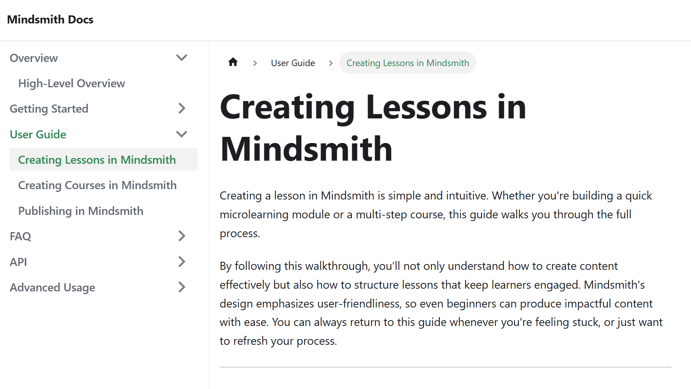

# High-Level Design Document for Mindsmith

<h1>What is Mindsmith?</h1>

[Mindsmith](https://www.mindsmith.ai/) is a tool that leverages AI to help content creators make high-level courses. It's very similar to [Rise](https://www.articulate.com/360/rise/) which is also a product that uses AI for E-learning. While both platforms leverage AI to accelerate content creation, **Mindsmith** differentiates itself by offering greater flexibility, microlearning-centered design, and fine-tuned AI editing controls, allowing creators to produce highly customized educational experiences.
This High-Level Design Document outlines the vision, scope, target audience, and key features of Mindsmith to guide its development and implementation.

---
<!-- Grey card-style Table of Contents block -->

  <h2 style="margin-top: 0;">📑 Table of Contents</h2>
  
<em>Quick access to all major sections of this documentation:</em>

  <ul style="list-style: none; padding: 0; line-height: 2;">
    <li><a href="#?id=project-overview" class="toc-link">🏠 Project Overview</a></li>
    <li><a href="#?id=scope" class="toc-link">🎯 Scope</a></li>
    <li><a href="#?id=outline" class="toc-link">🏁 Outline</a></li>
    <li><a href="#?id=key-features" class="toc-link">⭐ Key Features</a></li>
    <li><a href="#?id=target-audience" class="toc-link">👥 Target Audience</a></li>
    <li><a href="#?id=functional-requirements" class="toc-link">🛠️ Functional Requirements</a></li>
    <li><a href="#?id=planned-documentation-deliverables" class="toc-link">📝 Planned Documentation Deliverables</a></li>
    <li><a href="#?id=tools-and-technologies" class="toc-link">🖥️ Tools and Technologies</a></li>
    <li><a href="#?id=timeline" class="toc-link">📅 Timeline</a></li>
    <li><a href="#?id=risks-and-assumptions" class="toc-link">⚠️ Risks and Assumptions</a></li>
  </ul>

## 1. Project Overview 

Mindsmith provides an AI-powered e-learning platform for quickly building interactive, accessible, and branded microlearning content. This documentation suite supports both new users and advanced teams with guides, tutorials, and references structured for clarity, usability, and action.

---

## 2. Documentation Goals 

- Help users navigate Mindsmith’s interface and capabilities.
- Support new users through onboarding materials like a Quick Start Guide.
- Provide reference materials for developers integrating with Mindsmith.
- Offer power users tutorials on advanced use cases.
- Reduce support overhead through self-service resources like FAQs.

---

## 3. Scope 

The documentation suite includes:

- **User Guide**
- **Quick Start Guide**
- **API Reference**
- **FAQ**
- **Tutorials**

Each section will be modular and accessible from a persistent navigation system powered by Docusaurus or Docsify.

---

## 4. Outline of All Documentation 

### 4.1 User Guide 

The User Guide is the primary resource for navigating the full functionality of Mindsmith. It is designed for both new users and experienced instructional designers who want to explore all features of the platform. Each section will walk through workflows with annotated screenshots, contextual tips, and step-by-step breakdowns. The guide will be modular and searchable for quick access to specific tools.

#### Sections:
- Platform Overview
- Account and Settings
- Course Management
- Lesson Builder
- Collaboration & Teams
- Publishing & Sharing
- Accessibility & Best Practices

**Deliverables:**
- Full-length guide with Table of Contents
- Embedded screenshots, tooltips, and pro tips
- Contextual examples for each feature

<figcaption align="center">Figure 1: Screenshot preview of Mindsmith's platform walkthrough in the User Guide</figcaption>

---

### 4.2 API Reference 

The API Reference is a structured, developer-facing document that details how to authenticate, access, and manipulate Mindsmith content through its endpoints. It is aimed at developers integrating Mindsmith with LMSs, CRMs, or internal dashboards. Clear examples, response schemas, and best practices for security and rate limiting will be emphasized. All references will align to OpenAPI specifications and provide example payloads.

#### Sections:
- Authentication & Access Tokens
- Courses Endpoint
- Lessons Endpoint
- Users & Teams
- Error Handling
- Sample Integrations

**Deliverables:**
- OpenAPI-compliant structure
- Example requests and JSON responses
- Developer best practices and security notes

<figcaption align="center">Figure 2: API Reference sample showing Courses endpoint with sample cURL request</figcaption>

---

### 4.3 FAQ 

The FAQ section is a quick-access bank of frequently asked questions grouped by topic. It is designed to reduce support tickets and guide users toward deeper content when needed. Each question will be hyperlinked to relevant documentation or tutorials. This section is especially helpful for new users and those troubleshooting common issues.

#### Sections:
- Getting Started
- Course Building
- AI Features
- Troubleshooting
- Publishing & Sharing

**Deliverables:**
- Searchable question bank
- Quick links to deeper guides
- Categorized layout with collapsible sections

<figcaption align="center">Figure 3: FAQ section with expandable questions grouped by theme</figcaption>

---

### 4.4 Tutorials 

Tutorials are guided walkthroughs of real-world use cases and advanced platform features. These are perfect for onboarding power users or demonstrating how to get the most out of Mindsmith's AI-powered functionality. Each tutorial will include objectives, required prerequisites, and multimedia elements such as embedded video or animated GIFs. Content will focus on action, outcomes, and hands-on learning.

#### Topics:
- Building a Branded Template
- Using AI to Auto-Generate Lessons
- Embedding a Course
- LMS Integration
- Viewing Analytics

**Deliverables:**
- One tutorial per page
- “What You’ll Learn” preview block
- Screenshots and embedded video demonstrations

<figcaption align="center">Figure 4: Example tutorial on auto-generating lessons with AI showing before/after lesson preview</figcaption>

---

## 5. Target Audience 

- **Educators & Instructional Designers**: Seeking intuitive tools to create learning modules without coding.
- **Corporate Trainers**: Needing branded, microlearning content for internal training.
- **Developers**: Integrating Mindsmith with other systems using the API.
- **New Users**: Looking for guidance on onboarding, using AI, or publishing lessons.
- **Power Users**: Wanting to customize workflows, export SCORM files, and use analytics.

---

## 6. Timeline 

| Phase       | Task                           | Target Date    |
|-------------|--------------------------------|----------------|
| Phase 1     | User Guide Completion          | May 3, 2025    |
| Phase 2     | Quick Start Guide Completion   | May 5, 2025    |
| Phase 3     | API Reference Completion       | May 7, 2025    |
| Phase 4     | FAQ Completion                 | May 9, 2025    |
| Phase 5     | Tutorials Completion           | May 11, 2025   |
| Final Review| Review and Refinement          | May 12–13, 2025|

---

## 7. Tools and Technologies 

- **Docusaurus** for lightweight hosting
- **Markdown** for content creation
- **GitHub** for source control
- **VS Code** for editing
- **Postman/Swagger** for API design
- **Figma/Canva** for diagrams or visuals

---

## 8. Risks and Assumptions 

- **Risk**: Docusaurus or Docsify theming issues may delay styling work.
- **Risk**: Feature changes on Mindsmith’s platform could affect documentation accuracy.
- **Assumption**: Project is based on simulation and will not be subject to live feature freezes or stakeholder reviews.

---
